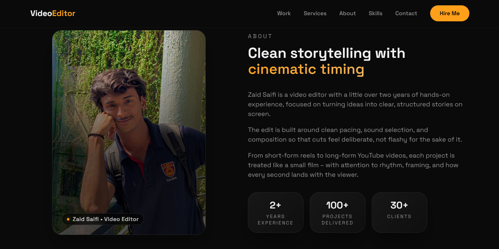
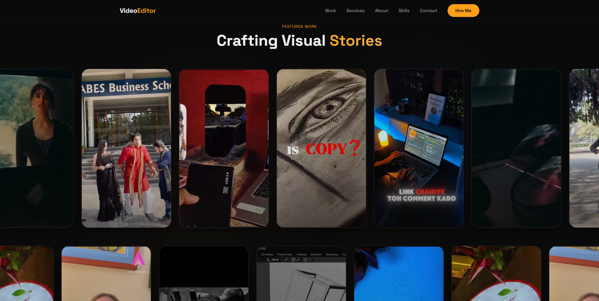
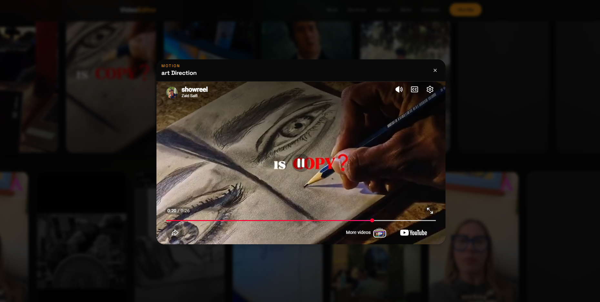

# ✨ Zaid's Portfolio

A modern cinematic developer portfolio built to showcase projects, creativity, technical skills, and interactive web experiences.

This portfolio reflects my passion for combining technology with storytelling, clean UI/UX, motion design, and AI-powered ideas.

---

## 🌐 Live Website

Visit here: [https://www.zaidsportfolio.in/](https://www.zaidsportfolio.in/)

---

# 🚀 About The Portfolio

This portfolio is designed as more than just a personal website.

It represents:

* My development journey
* Creative frontend experiments
* Interactive user experiences
* AI-focused projects
* Modern UI engineering
* Personal branding and storytelling

The website focuses heavily on smooth interactions, responsive layouts, premium visuals, and performance optimization.

---

# 🛠 Tech Stack

## Frontend

* Vite
* React.js
* TypeScript
* Tailwind CSS
* Framer Motion

## Styling & Animation

* Tailwind CSS
* Custom gradients
* Motion animations
* Scroll interactions
* Responsive layouts

## Deployment

* Vercel
* GitHub

---

# ✨ Features

* Modern cinematic UI
* Fully responsive design
* Smooth animations and transitions
* Interactive project showcase
* Optimized performance
* Clean and minimal layout
* Personal branding focused design
* Dark premium aesthetic
* Mobile-friendly experience

---

## Preview
<p align="center">
  
</p>

<p align="center">
  
</p>

<p align="center">
  
</p>


# 📂 Project Structure

```bash
portfolio/
├── public/
├── src/
│   ├── components/
│   ├── config/
│   ├── hooks/
│   ├── lib/
│   └── pages/
├── backend/
├── package.json
└── README.md
```

---

# ⚡ Installation & Setup

Clone the repository:

```bash
git clone https://github.com/zaid1234-11/portfolio.git
```

Move into the project directory:

```bash
cd portfolio
```

Install dependencies:

```bash
npm install
```

Run the development server:

```bash
npm run dev
```

Open in browser:

```bash
http://localhost:8080
```

---

# 🎨 Design Philosophy

The portfolio follows a cinematic and minimal design language.

Main inspirations include:

* Smooth storytelling
* Motion-driven interactions
* Emotional visual aesthetics
* Premium web experiences
* Clean typography
* Minimal yet expressive layouts

---

# 📱 Responsive Experience

The portfolio is optimized for:

* Desktop
* Laptop
* Tablet
* Mobile devices

Special attention has been given to animation smoothness and layout consistency across screen sizes.

---

# 📌 Goals Of This Portfolio

* Build a strong personal brand
* Showcase real projects professionally
* Create memorable user experiences
* Demonstrate frontend engineering skills
* Highlight creativity alongside technical ability

---

# 🧠 What I Love Building

* AI-powered applications
* Interactive websites
* Story-driven UI experiences
* Motion-rich interfaces
* Creative developer tools
* Experimental web experiences

---

# 🔥 Featured Work

Projects showcased in this portfolio include:

* AI-powered web applications
* Frontend UI experiments
* Interactive creative projects
* Full-stack development work
* Motion design concepts

---

# 📈 Future Improvements

Planned updates include:

* More case studies
* Advanced animations
* Performance enhancements
* AI integrations
* Improved accessibility
* Interactive storytelling sections

---

# 🤝 Connect With Me

## GitHub

[https://github.com/zaid1234-11](https://github.com/zaid1234-11)

## Portfolio

[https://www.zaidsportfolio.in/](https://www.zaidsportfolio.in/)

## LinkedIn

[https://www.linkedin.com/in/zaidsaifiai/](https://www.linkedin.com/in/zaidsaifiai/)

---

# ⭐ Support

If you like this portfolio, consider giving the repository a star.

It helps support my work and motivates me to keep building.

---

# 📜 License

This project is open-source and available under the MIT License.

---

# 💫 Final Note

This portfolio is a reflection of my creativity, curiosity, and passion for building meaningful digital experiences.

Thanks for visiting.
